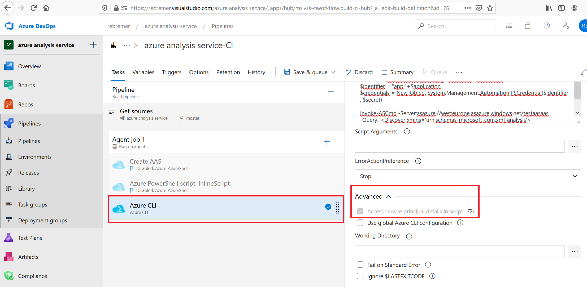

## Deploy models from Azure DevOps Service Connection to Azure Analysis Services 

This documention describes how to create a CICD pipeline from Azure DevOps to Azure Analysis Services. It is based on this [blog](https://medium.com/swlh/you-me-ci-cd-deploying-azure-analysis-services-tabular-models-through-azure-pipelines-55370ac9fab3) of [Liam Dunphy](https://medium.com/@liamejdunphy). This tutorial assumes basic knowledge of Azure and Azure DevOps. 
- Crucial in this documentation is that no separate Service Principal needs to be created, **everything is done using the service connection of Azure DevOps**.
- In this tutorial, Azure DevOps only queries Azure Analysis Service. For documentation how to create a full CICD pipeline, refer to blog above or this [DevOpsAnalysisServices git repo](https://github.com/frvigano/DevOpsAnalysisServices)

Steps to take:

-	Create an Azure Devops project. Then create a Service Connection in your Azure DevOps project of type “Azure Resource Manager” that has Owner/Contributor” rights on the resource group where your Azure Analysis Service is deployed

- Create an Azure CLI task in your Azure DevOps pipeline release pipeline. Make sure that the option: "Advanced: Access service principal details in script" is enabled, see also screenshot below




- Run code below

```PowerShell
# Get secrets from Azure DevOps Service Connection
$application = $env:servicePrincipalId
$tenant = $env:tenantId
$rawsecret = $env:servicePrincipalKey
$secret =  ConvertTo-SecureString $rawsecret -AsPlainText -Force 
$identifier = "app:"+$application
$credentials = New-Object System.Management.Automation.PSCredential($identifier , $secret)

# Add SPN of Azure DevOps Service Connection as admin to Azure Analysis Service 
$admin = "app:$($application)@$($tenant)"
Set-AzAnalysisServicesServer -Name "<<your AAS>>" -ResourceGroupName "<<your AAS Recourse Group>>" -Administrator $admin

# Query Azure Analysis Service from Azure DevOps. Invoke-ASCmd can also be used to deploy models, see blog
Invoke-ASCmd -Server:asazure://westeurope.asazure.windows.net/<<your aas service>> -Query:"<Discover xmlns='urn:schemas-microsoft-com:xml-analysis'><RequestType>DBSCHEMA_CATALOGS</RequestType><Restrictions /><Properties /></Discover>" -verbose -Credential $credentials -TenantId $tenant

```